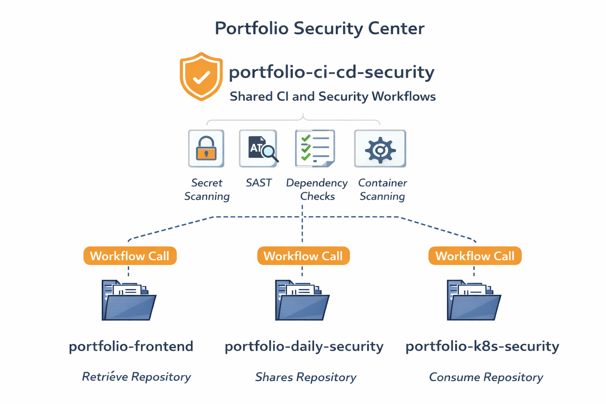

# Reusable CI and Security Workflows

## Overview

This repository acts as the shared security and CI control plane for the entire DevSecOps portfolio. It centralises security enforcement, CI logic, and policy checks used across multiple repositories through GitHub Actions workflow calls. This design removes duplication, enforces consistency, and provides a single source of truth for security controls.

## Purpose

The goal of this repository is to enforce security by default across all projects. Any repository consuming these workflows inherits the same security standards without copying logic or configuration.

- Core Capabilities
- Secret scanning across source code and commits
- Static application security testing for application code
- Dependency vulnerability scanning
- Container image scanning during build pipelines
- Fail fast enforcement for pull requests and main branch deployments
- Reusable workflows consumed through workflow_call

## Architecture Model

This repository functions as a shared security center. Downstream repositories trigger workflows from this repo instead of defining security logic locally. Results and evidence remain visible in the calling repository Actions logs.

### Diagram

CI and Security Architecture Diagram

## Connected Repositories

1. [Frontend application](https://github.com/asadyare/portfolio-frontend)

2. [Kubernetes Deployment and security](https://github.com/asadyare/portfolio-k8s-microservices-deployment)
3. [Daily security automation](https://github.com/asadyare/portfolio-daily-security)

Workflow Consumption Pattern
Repositories invoke shared workflows using GitHub Actions workflow calls.
Security logic executes centrally.
Results propagate back to the caller pipeline.
Failed checks block merge or deployment.

## Central Portfolio Reference

Primary portfolio index and documentation
[Central reposittory](https://github.com/asadyare/devsecops-portfolio-asad)

Operational Benefits
Single place to update security tooling
Consistent enforcement across projects
Clear audit trail inside GitHub Actions
Reduced configuration drift
Portfolio wide security posture visibility

## Contact

You can contact me via [walasaqo@gmail.com](mailto:walasaqo@gmail.com) or connect with me on [LinkedIn](https://www.linkedin.com/in/asad-hassan-20b540313/).

## License

This portfolio is licensed under the MIT License - see the [LICENSE](LICENSE) file for details.
